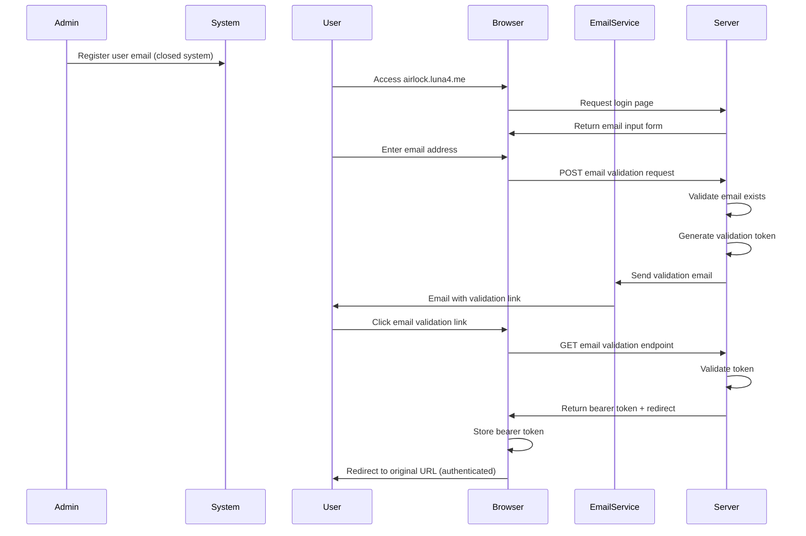

# Airlock

Airlock is the centralized authentication service for the Luna4 platform. Built with Go, it serves as a single authenticator that controls access to all Luna4 services, ensuring only authorized members can access the private services within the Luna4 ecosystem.

## Overview

Airlock provides secure authentication and authorization for the Luna4 platform, acting as a gateway to protect private services and resources.

## Features

- **Centralized Authentication**: Single sign-on for all Luna4 services
- **Email-Based Flow**: Secure passwordless authentication via email tokens
- **Token Generation**: Cryptographically secure 32-byte SHA256 tokens
- **Rate Limiting**: Configurable debounce protection (default 3 minutes)
- **Modern Web UI**: Responsive React-like interface with real-time feedback
- **Email Templates**: Professionally designed HTML emails with Luna4 branding
- **DynamoDB Integration**: Scalable user data storage with GSI support
- **AWS SES Integration**: Reliable email delivery through Amazon SES
- **RESTful API**: Clean `/api` endpoints with proper error handling
- **Environment Configuration**: Flexible setup via environment variables

## Authentication Flow

The authentication system follows a secure email-based flow:



### Current Implementation Status:

✅ **Phase 1 Complete**: Email Token Generation and Delivery
1. **User Access**: User visits Luna4 authentication page
2. **Email Input**: User enters email address in web interface
3. **Validation**: Server validates email format and checks user exists in DynamoDB
4. **Rate Limiting**: Enforces debounce period to prevent spam
5. **Token Generation**: Creates secure SHA256 token and stores in database
6. **Email Delivery**: Sends branded HTML email via AWS SES with authentication link

🚧 **Phase 2 (Pending)**: Token Validation and Session Management
7. **Email Link Click**: User clicks link to verify email and complete authentication
8. **Token Verification**: Server validates token and marks as completed
9. **Session Creation**: Generate bearer token for authenticated sessions
10. **Redirect**: Browser redirected to original URL with authentication

## Architecture

### Service Layer

The application follows a layered architecture pattern for maintainability and separation of concerns:

```
├── handler/           # HTTP request handlers
│   └── auth.go       # Authentication endpoints
├── service/           # Business logic and data access
│   ├── dynamodb.go   # Base DynamoDB client service
│   ├── user.go       # User-specific database operations
│   └── email.go      # AWS SES email service
├── model/            # Data models and structures
│   └── user.go       # User model with DynamoDB tags
├── util/             # Utility functions
│   └── auth.go       # Token generation utilities
├── templates/        # Email templates
│   └── email-auth.html # HTML email template
└── public/           # Frontend assets
    ├── index.html    # Authentication web interface
    ├── css/style.css # Modern styling
    └── js/auth.js    # Frontend JavaScript
```

### Data Flow

1. **HTTP Request**: Client sends request to handler endpoint
2. **Handler Layer**: Validates input, handles HTTP concerns
3. **Service Layer**: Contains business logic and database operations
4. **Database Layer**: DynamoDB operations through AWS SDK v2
5. **Response**: Data flows back through the layers to client

### Database Architecture

- **Table**: `Luna4Users` with email GSI (`email-index`)
- **Primary Service**: `DynamoDBService` - Base AWS client configuration and connection management
- **Entity Services**: `UserService` - User-specific database operations (queries, mutations)
- **Models**: Go structs with DynamoDB attribute tags for data marshaling

### API Endpoints

- **GET** `/` - Serves authentication web interface
- **GET** `/api/health` - Health check endpoint
- **POST** `/api/auth/email` - Email authentication request

### Frontend Features

- **Responsive Design**: Mobile-first approach with modern gradients
- **Real-time Validation**: Client-side email format validation
- **Loading States**: Visual feedback during API calls
- **Error Handling**: Comprehensive error messages for all scenarios
- **Rate Limiting UI**: Countdown timer for debounce periods
- **Success States**: Form hiding after successful submission

This architecture allows for easy extension with additional tables and services while maintaining a consistent data access pattern.

## Tech Stack

- **Backend**: Go 1.24+ with Gin HTTP framework
- **Database**: Amazon DynamoDB with Global Secondary Index
- **Email**: AWS SES (Simple Email Service)
- **Frontend**: Vanilla JavaScript with modern CSS
- **AWS SDK**: AWS SDK for Go v2
- **Configuration**: Environment variables via godotenv

## Getting Started

### Prerequisites

- Go 1.24+
- AWS Account with DynamoDB and SES access
- AWS credentials configured

### Environment Setup

1. Copy `.env.example` to `.env`:
```bash
cp .env.example .env
```

2. Configure your environment variables:
```env
# AWS Configuration
AWS_REGION=us-east-1
AWS_ACCESS_KEY_ID=your-access-key
AWS_SECRET_ACCESS_KEY=your-secret-key

# DynamoDB Configuration  
DYNAMODB_TABLE_NAME=Luna4Users
DYNAMODB_EMAIL_INDEX=email-index

# Application Configuration
PORT=8080
ENVIRONMENT=development

# Email Authentication Configuration
EMAIL_AUTH_DEBOUNCE=180
EMAIL_AUTH_SENDER=noreply@luna4.me
SERVICE_URL=localhost:8080
EMAIL_AUTH_PATH=/auth/email/verify
```

### Installation

1. Install dependencies:
```bash
go mod download
```

2. Run the application:
```bash
go run main.go
```

3. Access the authentication interface:
```
http://localhost:8080
```

### DynamoDB Setup

Ensure your DynamoDB table has:
- **Table Name**: `Luna4Users`
- **Partition Key**: `id` (String)
- **GSI**: `email-index` with partition key `email` (String)

## Contributing

[Contribution guidelines to be added]

## License

[License information to be added]